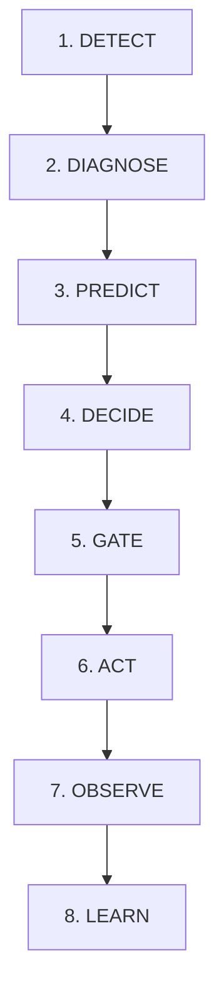

# revAIve — System Architecture

**Product Name:** revAIve  
**Tagline:** Bring lost revenue back.  
**Product Category:** Autonomous Revenue Recovery for Razorpay merchants.  
**Hackathon Track:** Track 03 — AI Revenue Recovery.

---

## 1. Executive Summary & Architectural Vision

**revAIve** is an autonomous revenue recovery engine built specifically for Razorpay merchants. It detects slipped revenue opportunities (failed recurring payments, uncaptured authorizations, soft-decline transactions, and dunning friction), diagnoses root causes, proposes optimal recovery interventions, gates execution through deterministic financial safety policies, executes bounded actions via Razorpay Test Mode APIs, and measures actual recovered revenue.

### Core Architectural Principle

> **AI proposes. Deterministic systems control execution.**

The Large Language Model (LLM) operates strictly as an intelligent reasoning, diagnostic, and strategy proposal engine. The LLM **never** has direct, unmediated authority over financial actions, transaction amounts, retry counts, or customer contact execution.

```
       UNTRUSTED / AI BOUNDARY               DETERMINISTIC SAFETY BOUNDARY
┌───────────────────────────────────┐    ┌───────────────────────────────────┐
│                                   │    │                                   │
│  [ Webhook Event Ingestion ]      │    │  [ Policy Gate Engine ]           │
│                │                  │    │   - Check Retry Budget            │
│                ▼                  │    │   - Check Customer Quiet Period   │
│  [ Opportunity Detection ]        │    │   - Enforce Approval Thresholds   │
│                │                  │    │   - Verify Integer Paise Amounts  │
│                ▼                  │    │                │                  │
│  [ AI Agent Diagnosis ]           │    │                ▼                  │
│   - Root Cause Classification     │    │  [ Deterministic Executor ]       │
│   - Recovery Likelihood Score     │───►│   - Idempotency Lock              │
│   - Candidate Strategy Proposal   │    │   - Razorpay API Test Mode Client │
│                                   │    │   - Immutable Audit Logger        │
└───────────────────────────────────┘    └───────────────────────────────────┘
```

---

## 2. Core Operational Loop

Every recovery workflow in revAIve passes through an explicit 8-stage state lifecycle:



1. **DETECT**: Ingest Razorpay webhooks (e.g. `payment.failed`, `subscription.halted`, `invoice.payment_failed`), normalize events, and instantiate a `RevenueOpportunity`.
2. **DIAGNOSE**: AI Agent inspects failure codes, payment instrument capabilities, customer transaction history, and error messages to identify the underlying failure cause.
3. **PREDICT**: AI Agent computes a recovery probability score ($P_{\text{recover}} \in [0.0, 1.0]$) and estimates expected recovered value.
4. **DECIDE**: AI Agent synthesizes a candidate recovery strategy (e.g. smart retry timing, payment link generation via SMS/WhatsApp, subscription mandate re-engagement).
5. **GATE**: Deterministic Policy Engine verifies all safety constraints (velocity limits, retry ceilings, customer quiet periods, high-value manual approval rules). If rejected, the strategy is blocked or escalated.
6. **ACT**: Bounded Executor executes approved actions through Razorpay API (or mock Test Mode client) using idempotent request tokens.
7. **OBSERVE**: System listens for downstream webhooks (`payment.captured`, `subscription.charged`), verifying outcome against expected target.
8. **LEARN**: System logs strategy yield, updates evaluation benchmarks, and feeds outcomes back into agent prompt context and strategy rankings.

---

## 3. Monorepo Structure

revAIve is structured as a clean, modular monorepo using standard workspace boundaries:

```
revAIve/
├── apps/
│   ├── api/                  # FastAPI backend server (REST APIs, Webhooks, Background Workers)
│   └── web/                  # Next.js 14+ frontend operations platform
├── packages/
│   ├── agent/                # AI Agent diagnostic engine, prompt templates & tool definitions
│   ├── database/             # SQLAlchemy schemas, PostgreSQL migrations (Alembic), repositories
│   ├── evaluation/           # Agent benchmark suite, scenario runner & yield measurement
│   ├── razorpay/             # Type-safe Razorpay client, webhook signature validator & test mocks
│   ├── shared/               # Shared domain types, constants, minor-unit currency utilities
│   └── ui/                   # Reusable React UI component library (shadcn/ui design tokens)
├── scripts/                  # Seed scripts, simulation runners, database helpers
├── tests/                    # End-to-end integration test suite & Playwright specs
├── docs/                     # Technical specifications & architectural documentation
├── docker-compose.yml        # Local development infrastructure setup
└── README.md
```

---

## 4. Subsystem Specifications

### 4.1 FastAPI Backend (`apps/api`)
- **Framework:** FastAPI (Python 3.11+) with Pydantic v2 validation.
- **Responsibilities:**
  - Fast HTTP Webhook ingress endpoint (`POST /api/v1/webhooks/razorpay`).
  - REST endpoints for the Next.js Operations UI (`/api/v1/opportunities`, `/api/v1/policy-lab`, `/api/v1/audit-log`).
  - Integration with Redis-backed background worker task processing (Celery or SAQ/ARQ).
- **Concurrency & Async:** Async HTTP routing with synchronous/threaded database pools for isolation.

### 4.2 Webhook Ingestion Engine (`packages/razorpay` + `apps/api`)
To ensure safety and high throughput under payment gateway load, webhook handling follows strict rules:

```
HttpRequest ──► [ 1. Raw Body Read ] ──► [ 2. HMAC-SHA256 Signature Check ]
                                                        │
                                                        ├── Reject (401 Unauthorized)
                                                        ▼
                                         [ 3. Persist Event (Idempotency Check) ]
                                                        │
                                                        ├── Duplicate -> Ack (200 OK)
                                                        ▼
                                         [ 4. Enqueue to Redis Worker ]
                                                        │
                                                        ▼
                                         [ 5. Immediate 200 OK Response ]
```

1. **Raw Body Reading:** Preserves binary byte array to prevent formatting/parsing changes during signature computation.
2. **HMAC Signature Check:** Computes `HMAC-SHA256(raw_body, secret)` against `X-Razorpay-Signature`. Rejects invalid requests instantly.
3. **Persist Event Identity:** Writes to `webhook_events` database table with `(event_id, provider)` unique constraint.
4. **Fast Ack:** Responds with `200 OK` in `< 50ms`.
5. **Async Processing:** Redis worker picks up the stored event for normalization and domain pipeline execution.

### 4.3 Deterministic Policy Engine (`packages/shared` & `apps/api`)
The Policy Engine is a pure, non-LLM Python component that evaluates strategy proposals against hard invariants:

- **Max Retries Rule:** No single transaction may be retried more than $N$ times (default: 3 retries in 72 hours).
- **Customer Quiet Period:** Maximum 1 customer-facing notification (SMS/Email/WhatsApp) per 24 hours per customer.
- **High-Value Threshold Gate:** Opportunities with `amount_in_minor > 5000000` (₹50,000) require manual operator approval in the UI before execution.
- **Currency Isolation:** Rejects any action attempting cross-currency conversions or mismatched currency units.

### 4.4 Next.js Operations UI (`apps/web`)
- **Stack:** Next.js (App Router), TypeScript, Tailwind CSS, Recharts.
- **Design Philosophy:** Dense, functional, professional fintech operations cockpit (inspired by Stripe Dashboard, Linear, Ramp).
- **Key Views:**
  - **Overview:** Real-time metrics (Total At Risk, Total Recovered, Recovery Yield %, Active Interventions).
  - **Revenue Opportunities:** Dense tabular list with status filters, risk tags, amount sorting, and detailed drawer view.
  - **Recovery Queue:** Pending actions, policy gate results, and manual approval workflows.
  - **Policy Lab:** Interactive policy visualizer & sandbox rule editor.
  - **Audit Log:** Chronological, immutable timeline of every decision and system state transition.

---

## 5. Technology Stack & Decision Rationale

| Layer | Technology | Decision Rationale |
| :--- | :--- | :--- |
| **Frontend Framework** | Next.js 14+ (React / TS) | Server-Side Rendering (SSR) capability, clean routing, excellent developer experience for enterprise dashboards. |
| **Styling & Components** | Tailwind CSS + shadcn/ui | High information density UI components, consistent typography and CSS token control without generic bloated templates. |
| **Data Visualization** | Recharts | Light, declarative SVG charts tailored for financial trends, recovery funnels, and cohort analysis. |
| **Backend Framework** | FastAPI (Python) | High-performance async processing, native Pydantic v2 data serialization, direct integration with AI/LLM Python toolchains. |
| **Database** | PostgreSQL 16 | Relational consistency, robust JSONB support for diagnostic evidence, strict ACID transaction support. |
| **ORM & Migrations** | SQLAlchemy 2.0 + Alembic | Explicit, type-safe database queries, schema migration management. |
| **Queue & Worker** | Redis + ARQ / Celery | Reliable asynchronous execution of webhook tasks, AI inference jobs, and scheduled retries. |
| **Testing** | Pytest + Playwright | End-to-end backend pipeline testing and robust browser-level operational UI testing. |
| **Containerization** | Docker Compose | One-command local development environment reproduction. |

---

## 6. Financial Data & Currency Handling

To eliminate floating-point precision errors (e.g. `0.1 + 0.2 = 0.30000000000000004`), revAIve enforces:

1. **Integer Minor Units:** All monetary values are strictly stored and manipulated as `BIGINT` in minor units (e.g., paise for INR, cents for USD).
   $$\text{Amount in Paise} = \text{Amount in Rupees} \times 100$$
2. **Explicit Currency Code:** Stored alongside every monetary field as an ISO 4217 standard string (e.g. `"INR"`).
3. **No Implicit Math Across Currencies:** Operations comparing or aggregating amounts must assert identical currency strings.

---

## 7. Webhook & Execution Security Invariants

1. **Webhook HMAC Validation:** Mandatory verification using the raw HTTP request payload before any database read/write.
2. **Idempotent API Calls:** Every outgoing Razorpay API call includes an idempotency key structured as `rev_act_{action_id}_{attempt}`.
3. **Immutable Audit Logging:** Every state transition creates an append-only `audit_logs` record containing actor, timestamp, input event, policy output, and execution outcome.
