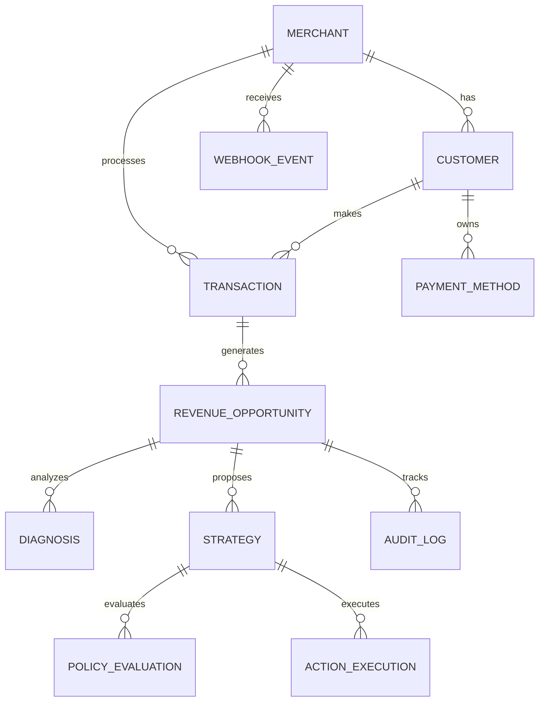

# revAIve — Data Model & Database Schema

**Product Name:** revAIve  
**Database System:** PostgreSQL 16  
**ORM / Schema Definition:** SQLAlchemy 2.0 (Python) + Alembic Migrations

---

## 1. Monetary Data Integrity Rules

1. **Integer Minor Units:** Monetary values MUST be stored as signed 64-bit integers (`BIGINT`) representing minor currency units (e.g. paise for INR).
   - Example: ₹1,499.00 = `149900` paise.
   - Column naming convention: `<field>_in_minor` (e.g. `amount_in_minor`, `recovered_amount_in_minor`).
2. **ISO 4217 Currency Codes:** Every table containing monetary amounts MUST store an accompanying `currency` string (`VARCHAR(3)`), defaulting to `'INR'`.
3. **No Floating Point:** Float or Double precision numeric types are strictly forbidden for financial columns.

---

## 2. Entity Relationship Diagram (ERD)

---

## 3. Database Schema Definitions

### 3.1 `merchants`
Represents a Razorpay merchant organization onboarded to revAIve.

| Column | Type | Constraints | Description |
| :--- | :--- | :--- | :--- |
| `id` | `UUID` | Primary Key | Internal system identifier |
| `name` | `VARCHAR(255)` | NOT NULL | Merchant organization name |
| `razorpay_merchant_id` | `VARCHAR(64)` | NOT NULL, UNIQUE | Merchant ID from Razorpay |
| `webhook_secret` | `VARCHAR(255)` | NOT NULL | Encrypted HMAC webhook secret |
| `created_at` | `TIMESTAMPTZ` | NOT NULL, Default: `NOW()` | Registration timestamp |
| `updated_at` | `TIMESTAMPTZ` | NOT NULL, Default: `NOW()` | Last update timestamp |

---

### 3.2 `customers`
Merchant's end customers whose payments are monitored.

| Column | Type | Constraints | Description |
| :--- | :--- | :--- | :--- |
| `id` | `UUID` | Primary Key | Internal identifier |
| `merchant_id` | `UUID` | FK -> `merchants.id`, NOT NULL | Belongs to merchant |
| `razorpay_customer_id` | `VARCHAR(64)` | NOT NULL | Razorpay Customer ID (`cust_...`) |
| `email` | `VARCHAR(255)` | NULLABLE | Customer email address |
| `phone` | `VARCHAR(32)` | NULLABLE | Customer phone number |
| `risk_score` | `NUMERIC(3,2)` | Default: `0.00` | Historical risk tier (0.0 to 1.0) |
| `last_contacted_at` | `TIMESTAMPTZ` | NULLABLE | Quiet period calculation anchor |
| `created_at` | `TIMESTAMPTZ` | NOT NULL, Default: `NOW()` | Record creation timestamp |

---

### 3.3 `payment_methods`
Payment instruments attached to customers.

| Column | Type | Constraints | Description |
| :--- | :--- | :--- | :--- |
| `id` | `UUID` | Primary Key | Internal identifier |
| `customer_id` | `UUID` | FK -> `customers.id`, NOT NULL | Belongs to customer |
| `type` | `VARCHAR(32)` | NOT NULL | `card`, `upi`, `mandate`, `netbanking` |
| `issuer` | `VARCHAR(64)` | NULLABLE | Issuing bank (e.g. HDFC, ICICI) |
| `network` | `VARCHAR(32)` | NULLABLE | Card network (`visa`, `mastercard`) |
| `last4` | `VARCHAR(4)` | NULLABLE | Last 4 digits of instrument |
| `expiry_month` | `INTEGER` | NULLABLE | Card expiration month |
| `expiry_year` | `INTEGER` | NULLABLE | Card expiration year |
| `is_active` | `BOOLEAN` | Default: `TRUE` | Whether instrument is valid |

---

### 3.4 `webhook_events`
Raw and normalized webhooks ingested from Razorpay.

| Column | Type | Constraints | Description |
| :--- | :--- | :--- | :--- |
| `id` | `UUID` | Primary Key | Internal identifier |
| `merchant_id` | `UUID` | FK -> `merchants.id`, NOT NULL | Target merchant |
| `event_id` | `VARCHAR(128)` | NOT NULL | Razorpay webhook event ID (`event_...`) |
| `event_type` | `VARCHAR(64)` | NOT NULL | `payment.failed`, `subscription.halted` |
| `raw_payload` | `JSONB` | NOT NULL | Full un-truncated request body |
| `processed` | `BOOLEAN` | Default: `FALSE` | Downstream queue processing flag |
| `received_at` | `TIMESTAMPTZ` | NOT NULL, Default: `NOW()` | Ingestion timestamp |

*Index:* `UNIQUE(merchant_id, event_id)` for duplicate prevention.

---

### 3.5 `transactions`
Normalized financial transactions recorded from gateway webhooks.

| Column | Type | Constraints | Description |
| :--- | :--- | :--- | :--- |
| `id` | `UUID` | Primary Key | Internal identifier |
| `merchant_id` | `UUID` | FK -> `merchants.id`, NOT NULL | Merchant context |
| `customer_id` | `UUID` | FK -> `customers.id`, NOT NULL | Customer context |
| `razorpay_payment_id` | `VARCHAR(64)` | NOT NULL, UNIQUE | Razorpay payment ID (`pay_...`) |
| `razorpay_order_id` | `VARCHAR(64)` | NULLABLE | Razorpay order ID (`order_...`) |
| `amount_in_minor` | `BIGINT` | NOT NULL | Payment amount in paise |
| `currency` | `VARCHAR(3)` | NOT NULL, Default: `'INR'` | ISO 4217 currency code |
| `status` | `VARCHAR(32)` | NOT NULL | `failed`, `captured`, `authorized` |
| `error_code` | `VARCHAR(64)` | NULLABLE | Razorpay failure code |
| `error_description` | `TEXT` | NULLABLE | Human-readable gateway failure reason |
| `created_at` | `TIMESTAMPTZ` | NOT NULL, Default: `NOW()` | Gateway timestamp |

---

### 3.6 `revenue_opportunities`
The central domain object representing recoverable lost revenue.

| Column | Type | Constraints | Description |
| :--- | :--- | :--- | :--- |
| `id` | `UUID` | Primary Key | Internal identifier |
| `merchant_id` | `UUID` | FK -> `merchants.id`, NOT NULL | Owning merchant |
| `transaction_id` | `UUID` | FK -> `transactions.id`, NOT NULL | Linked failed transaction |
| `customer_id` | `UUID` | FK -> `customers.id`, NOT NULL | Linked customer |
| `amount_in_minor` | `BIGINT` | NOT NULL | Original lost revenue in paise |
| `recovered_amount_in_minor` | `BIGINT` | Default: `0` | Actual recovered revenue in paise |
| `currency` | `VARCHAR(3)` | NOT NULL, Default: `'INR'` | ISO 4217 currency |
| `status` | `VARCHAR(32)` | NOT NULL | `detected`, `diagnosed`, `policy_checked`, `pending_approval`, `approved`, `executing`, `succeeded`, `failed`, `exhausted`, `escalated`, `closed` |
| `recovery_score` | `NUMERIC(3,2)` | NULLABLE | AI predicted recovery score (0.00 to 1.00) |
| `attempts_count` | `INTEGER` | Default: `0` | Executed retry count |
| `max_attempts` | `INTEGER` | Default: `3` | Hard policy cap for retries |
| `next_retry_at` | `TIMESTAMPTZ` | NULLABLE | Scheduled timestamp for next retry |
| `created_at` | `TIMESTAMPTZ` | NOT NULL, Default: `NOW()` | Ingestion timestamp |
| `updated_at` | `TIMESTAMPTZ` | NOT NULL, Default: `NOW()` | Last state transition |

---

### 3.7 `diagnoses`
Structured AI reasoning and diagnosis records.

| Column | Type | Constraints | Description |
| :--- | :--- | :--- | :--- |
| `id` | `UUID` | Primary Key | Internal identifier |
| `opportunity_id` | `UUID` | FK -> `revenue_opportunities.id` | Target opportunity |
| `root_cause_code` | `VARCHAR(64)` | NOT NULL | e.g. `INSUFFICIENT_FUNDS`, `EXPIRED_CARD`, `BANK_OUTAGE` |
| `reasoning_summary` | `TEXT` | NOT NULL | Concise diagnostic text summary |
| `confidence` | `NUMERIC(3,2)` | NOT NULL | LLM confidence metric |
| `evidence` | `JSONB` | NOT NULL | Failure metadata, bank telemetry references |
| `created_at` | `TIMESTAMPTZ` | NOT NULL, Default: `NOW()` | Diagnostic creation timestamp |

---

### 3.8 `strategies`
Candidate recovery action strategies generated by the AI agent.

| Column | Type | Constraints | Description |
| :--- | :--- | :--- | :--- |
| `id` | `UUID` | Primary Key | Internal identifier |
| `opportunity_id` | `UUID` | FK -> `revenue_opportunities.id` | Target opportunity |
| `strategy_type` | `VARCHAR(64)` | NOT NULL | `SMART_RETRY`, `PAYMENT_LINK_SMS`, `WHATSAPP_DUNNING`, `MANDATE_REPRIME` |
| `proposed_delay_seconds` | `INTEGER` | Default: `0` | Recommended delay before execution |
| `channel` | `VARCHAR(32)` | NOT NULL | `api_gateway`, `sms`, `whatsapp`, `email` |
| `payload_draft` | `JSONB` | NOT NULL | Proposed parameters for execution |
| `ranking` | `INTEGER` | Default: `1` | Preference rank (1 = primary) |
| `created_at` | `TIMESTAMPTZ` | NOT NULL, Default: `NOW()` | Proposal timestamp |

---

### 3.9 `policy_evaluations`
Deterministic gate evaluation logs testing strategies against system safety rules.

| Column | Type | Constraints | Description |
| :--- | :--- | :--- | :--- |
| `id` | `UUID` | Primary Key | Internal identifier |
| `strategy_id` | `UUID` | FK -> `strategies.id`, NOT NULL | Strategy evaluated |
| `passed` | `BOOLEAN` | NOT NULL | Overall policy verdict |
| `requires_approval` | `BOOLEAN` | Default: `FALSE` | High-value or restricted action gate |
| `failed_rules` | `JSONB` | Default: `'[]'` | List of violated policy rules |
| `evaluated_at` | `TIMESTAMPTZ` | NOT NULL, Default: `NOW()` | Evaluation timestamp |

---

### 3.10 `action_executions`
Executed recovery actions dispatched to external APIs.

| Column | Type | Constraints | Description |
| :--- | :--- | :--- | :--- |
| `id` | `UUID` | Primary Key | Internal identifier |
| `strategy_id` | `UUID` | FK -> `strategies.id`, NOT NULL | Parent strategy |
| `idempotency_key` | `VARCHAR(128)` | NOT NULL, UNIQUE | `rev_act_{id}_{attempt}` |
| `status` | `VARCHAR(32)` | NOT NULL | `dispatched`, `succeeded`, `failed` |
| `external_reference` | `VARCHAR(128)` | NULLABLE | Razorpay payout/payment link ID |
| `error_response` | `JSONB` | NULLABLE | Response on gateway failure |
| `executed_at` | `TIMESTAMPTZ` | NOT NULL, Default: `NOW()` | Execution timestamp |

---

### 3.11 `audit_logs`
Immutable audit trail recording every state change and system decision.

| Column | Type | Constraints | Description |
| :--- | :--- | :--- | :--- |
| `id` | `UUID` | Primary Key | Internal identifier |
| `opportunity_id` | `UUID` | FK -> `revenue_opportunities.id` | Opportunity context |
| `action_id` | `UUID` | NULLABLE | Linked action execution if applicable |
| `actor_type` | `VARCHAR(32)` | NOT NULL | `system_worker`, `ai_agent`, `policy_engine`, `merchant_operator` |
| `actor_id` | `VARCHAR(128)` | NOT NULL | Identifier of actor or service |
| `event_name` | `VARCHAR(64)` | NOT NULL | State change or decision title |
| `payload` | `JSONB` | NOT NULL | Full state snapshot or event data |
| `timestamp` | `TIMESTAMPTZ` | NOT NULL, Default: `NOW()` | Append-only event timestamp |

*Index:* `CREATE INDEX idx_audit_opportunity ON audit_logs(opportunity_id, timestamp DESC);`
