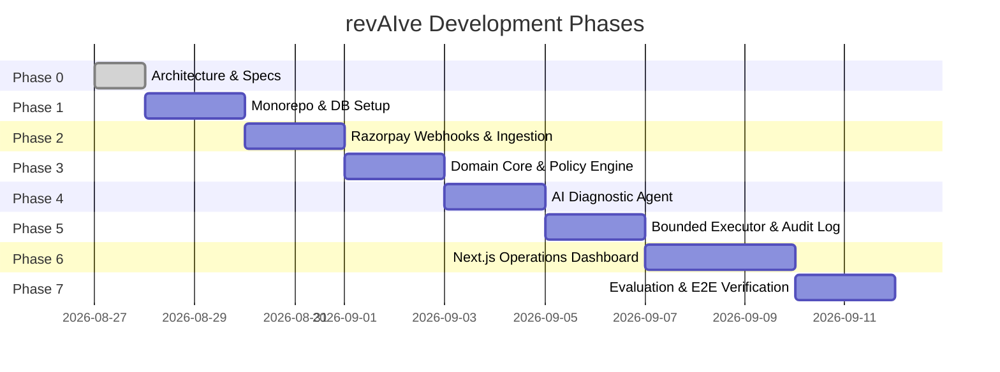

# revAIve — Implementation Roadmap & Execution Plan

**Product Name:** revAIve  
**Tagline:** Bring lost revenue back.  
**Product Category:** Autonomous Revenue Recovery for Razorpay merchants.  
**Track:** Track 03 — AI Revenue Recovery.

---

## 1. Phased Execution Roadmap

The implementation of revAIve follows a strict, disciplined phased approach to maximize architectural integrity, financial safety, and testability.

---

## 2. Detailed Phase Breakdown

### Phase 0: System Architecture & Specifications (Current Phase)
- **Goal:** Establish domain boundaries, technology stack, data schemas, security invariants, and project structure.
- **Deliverables:**
  - `docs/ARCHITECTURE.md`
  - `docs/PRODUCT_SPEC.md`
  - `docs/DATA_MODEL.md`
  - `docs/SECURITY.md`
  - `docs/AGENT_DESIGN.md`
  - `docs/IMPLEMENTATION_PLAN.md`
- **Validation Criteria:** Complete alignment with Track 03 requirements and financial safety guidelines.

---

### Phase 1: Core Monorepo Setup & Database Infrastructure
- **Goal:** Initialize monorepo structure, containerized environment, and PostgreSQL database migrations.
- **Tasks:**
  1. Set up monorepo directory layout (`apps/web`, `apps/api`, `packages/*`).
  2. Configure `docker-compose.yml` for PostgreSQL 16, Redis, and FastAPI API container.
  3. Implement SQLAlchemy models in `packages/database` matching `docs/DATA_MODEL.md`.
  4. Initialize Alembic migrations script and verify DB connectivity.
  5. Build `packages/shared` with currency minor unit utilities (paise conversion, ISO 4217 verification).
- **Validation Criteria:** `pytest` database connection test passes; Alembic migration applies cleanly.

---

### Phase 2: Webhook Ingestion Engine & Razorpay Package
- **Goal:** Create fast, secure, idempotent webhook ingress.
- **Tasks:**
  1. Build `packages/razorpay` with raw body HMAC-SHA256 signature verifier.
  2. Create FastAPI endpoint `POST /api/v1/webhooks/razorpay` in `apps/api`.
  3. Implement duplicate event prevention (`webhook_events` table unique constraint).
  4. Integrate Redis queue worker to consume ingested webhooks asynchronously.
- **Validation Criteria:** Webhook unit test suite passes invalid signature rejection, idempotency checks, and `< 50ms` response times.

---

### Phase 3: Domain Core & Deterministic Policy Engine
- **Goal:** Implement `RevenueOpportunity` lifecycle pipeline and safety gates.
- **Tasks:**
  1. Implement domain normalization pipeline (convert raw webhook payload to `RevenueOpportunity`).
  2. Build deterministic Policy Engine in `packages/shared` / `apps/api`:
     - Max Retry Limit Rule (<= 3 retries).
     - Customer Quiet Period Rule (>= 24h since last message).
     - High-Value Approval Gate (> 50,000 INR -> PENDING_APPROVAL state).
     - Integer Minor Unit math validator.
- **Validation Criteria:** Pytest suite verifying 100% policy enforcement across edge cases.

---

### Phase 4: AI Agent Diagnostic Engine
- **Goal:** Implement root-cause reasoning and candidate strategy generator.
- **Tasks:**
  1. Build `packages/agent` with prompt templates and Pydantic response validators.
  2. Implement allowlisted diagnostic tools (`get_customer_payment_history`, `lookup_bank_status`).
  3. Implement $P_{\text{recover}}$ confidence calculator.
  4. Hook AI Agent into the async worker pipeline after opportunity detection.
- **Validation Criteria:** Unit tests verifying agent returns valid Pydantic diagnostic output without hallucinating invalid strategy schemas.

---

### Phase 5: Bounded Executor & Immutable Audit Trail
- **Goal:** Safely dispatch approved actions and log every state transition.
- **Tasks:**
  1. Build Razorpay Test Mode API client in `packages/razorpay` with idempotency token injection (`rev_act_{id}_{attempt}`).
  2. Implement bounded executor worker node.
  3. Build append-only `audit_logs` database repository.
  4. Wire audit logger into every pipeline transition (DETECT, DIAGNOSE, GATE, ACT, OBSERVE).
- **Validation Criteria:** Integration tests confirming no double-execution, complete audit log trail for every attempt.

---

### Phase 6: Next.js Operations Frontend
- **Goal:** Deliver an enterprise-grade fintech operations UI.
- **Tasks:**
  1. Initialize Next.js 14 (App Router) in `apps/web` with Tailwind CSS and `packages/ui` (shadcn/ui tokens).
  2. Build **Overview Dashboard** (Total At Risk, Total Recovered, Yield %, Active Interventions chart).
  3. Build **Revenue Opportunities View** (dense filterable table, opportunity drawer detail view).
  4. Build **Recovery Queue** (manual approval workflows for high-value transactions).
  5. Build **Policy Lab** (interactive policy rule editor & safety checker).
  6. Build **Audit Log Viewer** (chronological event stream with JSON payload inspector).
- **Validation Criteria:** UI renders cleanly, responsive layout, monospaced currency formatting, real data bindings.

---

### Phase 7: Evaluation Framework & E2E Verification
- **Goal:** Benchmark diagnostic performance and run end-to-end integration tests.
- **Tasks:**
  1. Implement benchmark runner in `packages/evaluation` with 100+ synthetic failure cases.
  2. Write Playwright E2E tests simulating full flow (Webhook -> Detection -> Diagnosis -> Policy Gate -> Operator Approval -> Test Mode Execution -> Dashboard Update).
  3. Benchmark yield and document performance metrics.
- **Validation Criteria:** All Playwright and Pytest suites pass; complete end-to-end recovery demonstrated.
